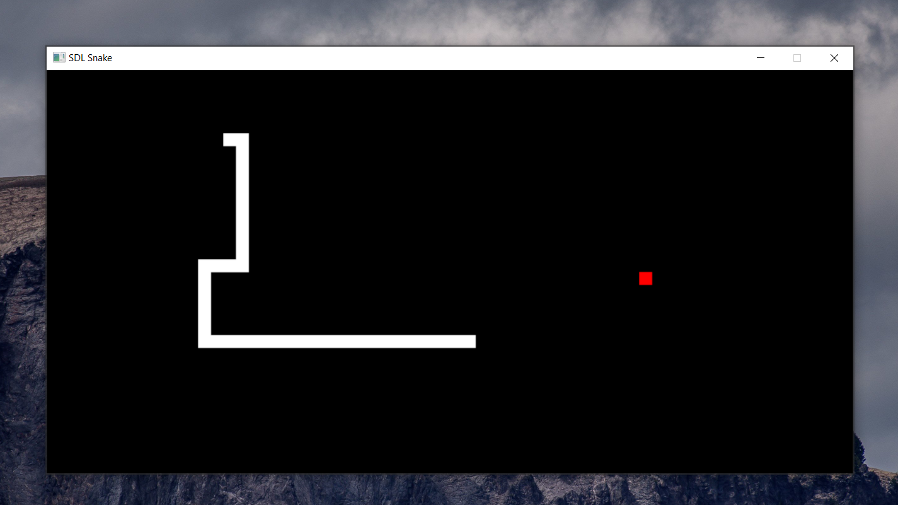

# SDLSnake
personal project to learn c++.



Used a linked list to represent snake in memory and 2D array for the play field. Utilizes seperate thread for renderering so user input isn't bound to fps.

# Usage
## Windows
```
Clone repo and run SDLSnake.exe
```
## macOS/ Linux
```
Clone repo, install dependencies, then running something like g++ main.cpp -lSDL -std=c++0x -lpthread -o SDLSnake should do the trick
```
